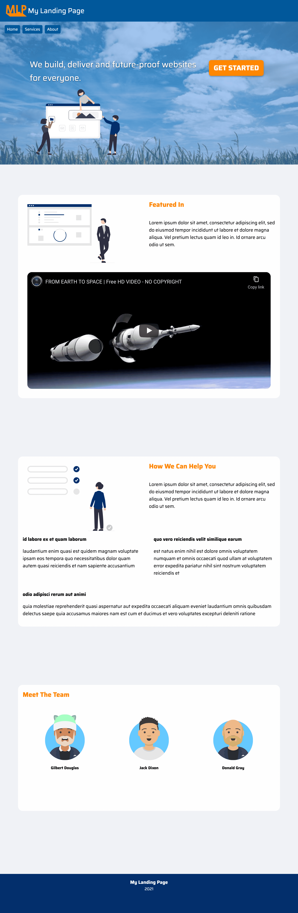
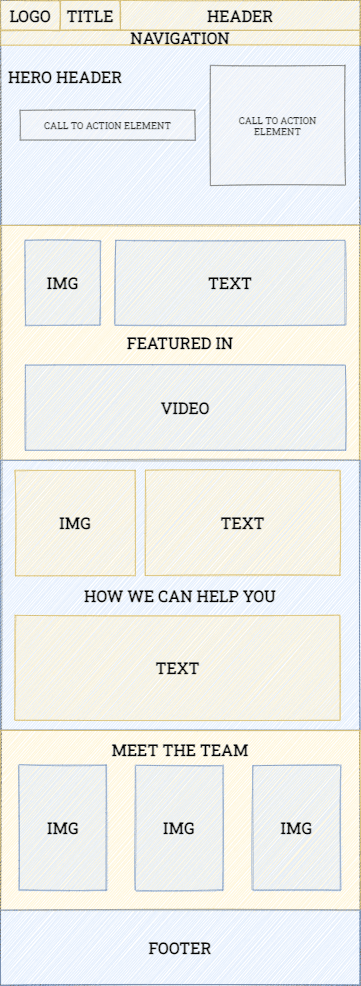
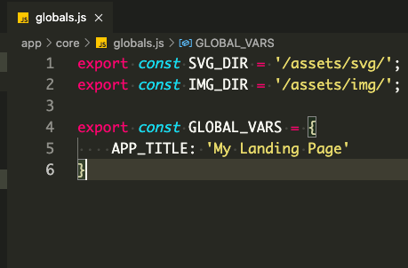
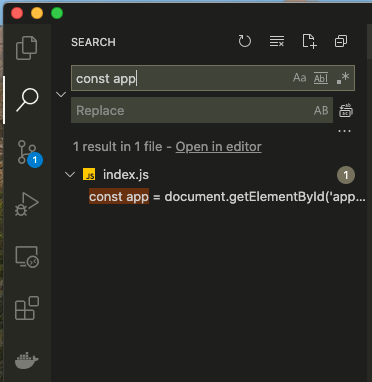
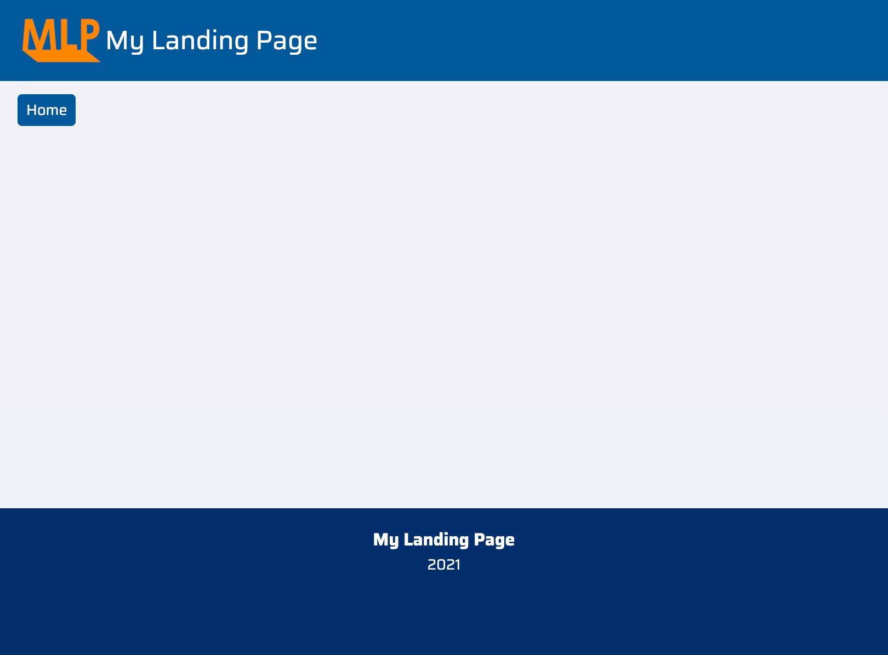
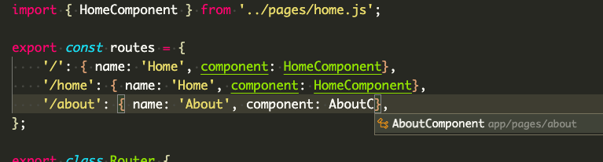
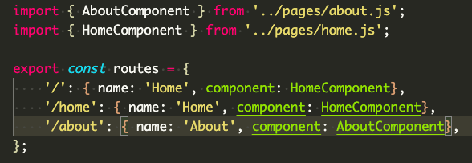
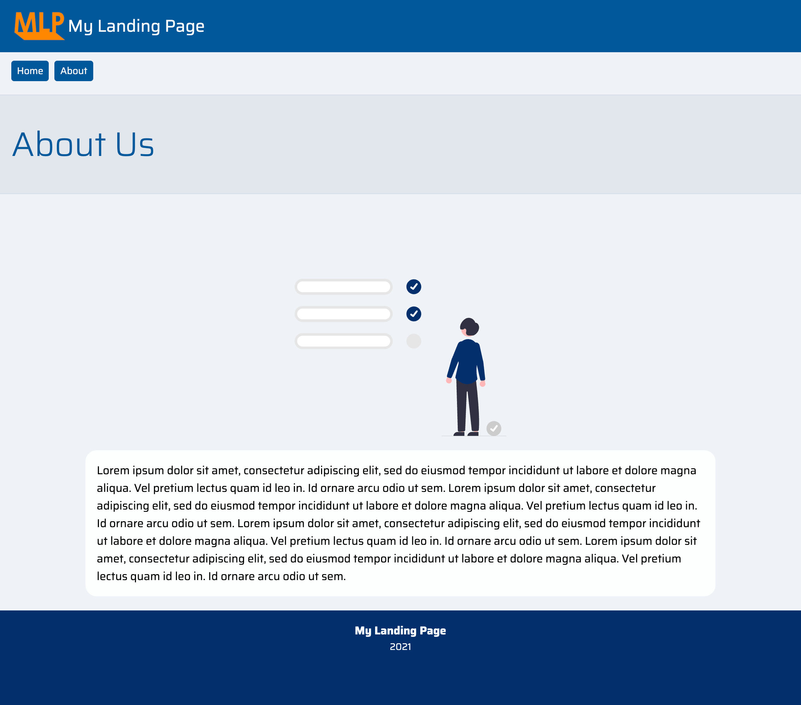
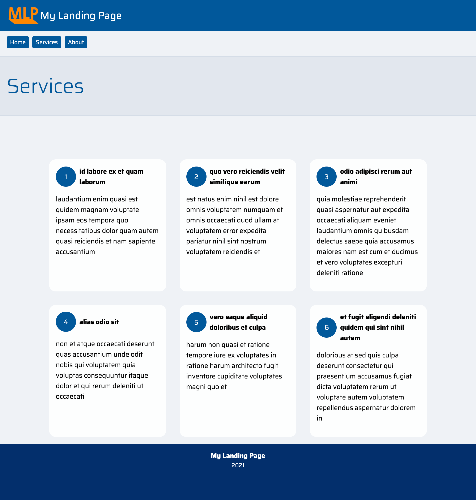

**Full-Stack Developer Path | Virtual Lab Activity | Week 1 | Fundamentals Of Building a Website | Feb 2021**

# Digital Future Leaders Program

### Let's Build a Modern Landing Page in 1 hour


In this virtual lab activity, you will build a modern landing page using HTML, CSS and JavaScript. You will use different kind of techniques to build it using JS Module techniques.

To make the activity interesting, you will be assuming the role of a freelancer who received a work from certain client who is in need of a landing page for their company.


### What you will build:

Here's a visual look of what you will be building by following this activity steps:


From this


To this




### Learning Objectives

By the end of this activity you will learn the following:

- A quick glimpse into Software Development Life Cycle
- Use git to clone a repository
- Use live-server npm package to run a local http server
- How to Import and export JS modules
- How to create a simple routing class to navigate from page to another
- Use CSS variables to speed up styling
- Learn about DRY principle
- Learn about async/await
- How to consume API in JavaScript


### The problem comes before the solution

Before jumping straight to coding, try to imagine for a moment that you are a freelancer developer experienced in building web apps and you were looking for a work. You were selected by a client who wanted a landing page for their new IT Consultancy Start-Up.

"I want a website where I can see a landing page that shows information about my company. The website should have a landing page, services page, and about us page. I want it to be very easy for other developers to modify it. And I want it to be fast. I want the website to be filled with placeholder text and images. The design should be modern, responsive and in blue/orange color theme. Also I want you to set up some API calls in the pages so that our developer can easily replace it with other real content later. Our developer is fairly junior so we recommend not to use any JavaScript framework and prefer to use Vanilla JavaScript for this website."

### Requirement Gathering


https://en.wikipedia.org/wiki/Iterative_and_incremental_development#/media/File:Iterative_development_model.svg


Assume you're dealing with this problem using an iterative approach where you receive requirements from a client, analyse them and come up with a design. Then start implemeting it while getting constant feedback from the client until the solution is satisfies the client's need.


What you have to do now is to translate those requirements into output, also known as (stories, tasks, work streams, etc). Eventually, you made the To-Do List which you have to follow to track your progress.


### To-Do List

Build a Modern Landing Page website

- **Design Requirements**
  - Color Schema: Blue
  - Design Theme: Modern
  - Responsive: Yes
- **Technical Requirements**
  - Core
    - Vanilla JS
    - Modular design
      - app folder
        - components folder: This is where shared components go. They should be easily imported into other files
          - layout/footer.js
          - layout/header.js
          - layout/nav.js
        - core folder: This is where core components will go such as globals and router class
          - globals.js
          - router.js
        - pages folder: This is where pages file will be created.
          - about.js
          - home.js
          - services.js
      - index.js file: This is the bootstrap file that will be executed at first which will define how the application works. It will have the default layout of the website in this order:
        - Header component
          - Show website logo
          - Show website title
        - Navigation component
          - Show list of links
        - Router content: This is where the content of the pages will appear, depending on the current route. e.g. /about
        - Footer component
          - Show website title
          - Show current year
  - Pages
    - Landing Page (Home)
      - Show relevant content with placeholder content
        - Hero Header with CTA (Call-To-Action) content. The CTA button should redirect the user to services page
        - Featured In section with image, text and video
        - How We Can Help you section with testomonials pulled from API call
        - Meet the team section that shows the team member name and photo
    - Services
      - Populate list of services pulled from API call in this template
        - Show number of the service
        - Show service title
        - Show service description
    - About Us
      - Simple About Us page with placeholder content
        - Show a sample image
        - Show sample paragraph


Let's start with the first step


#### Sketching out a wireframe using draw.io (diagrams.net)

Let's assume you are able to sketch out what the landing page should look like. And you came up with this wireframe which we will use at the beginning as a foundation.




Now that the requirements are clear, let's start coding! To speed things up and avoid problems, there is a starter code that you have to use to proceed further.


#### Cloning the starter pack

If you already haven't done so, clone the repository by running the following command from the terminal.

```bash
git clone https://github.com/Marmoro/ejsp-01-landing-page-starter.git
```


After cloning is complete, navigate to the folder which you have cloned

```bash
cd ejsp-01-landing-page-starter
```


Then run the following command to install [npm](https://www.npmjs.com/get-npm) packages. The only package installed is live-server.

```bash
npm i
```


Open the folder in VS Code by running the following command:

```bash
code .
```

*Tip: The dot . means open VS Code in the current directory*


If you want to see how the website looks like, run the following command. It will start live-server on port 8080. 
```
node_modules/live-server/live-server.js --port=8080 --entry-file=./index.html
```


To stop it hit **CTRL+C** or close the terminal. Whenever you have to see how the website looks like just the this command. And make sure you are at the root directory of ejsp-01-landing-page-starter when you run it.


Now this is clear, let's move forward to create some new files.

***

#### Creating a folder structure as specified in the To-Do List
Let's add a <u>New Folder</u> in **app** directory and call it **components**.

Add another <u>New Folder</u> within the new folder you created **app/components** and call it **layout**.


You will use this folder to add some layout classes later.

#### Creating the globals file

Create a <u>New File</u> and call it **globals.js** in **app/core**

This file will be used to store all necessary global variables that you want to use frequently. Why need one? Because you don't want to end up repeating the same strings every where else. Instead, you can store these strings in one file so that you can import them whenever needed.


Tip: Take a look at [Don't repeat yourself (DRY)](https://en.wikipedia.org/wiki/Don%27t_repeat_yourself) principle


Open globals.js and add the following constants:

```javascript
export const SVG_DIR = '/assets/svg/';
export const IMG_DIR = '/assets/img/';
```

These will be used to easily reference SVG and images from their directory so that you don't have to write '/assets/svg/' every time.


Do you think we can apply this princible to other cases? Let's add more global constants!

```javascript
export const GLOBAL_VARS = {
    APP_TITLE: 'My Landing Page'
}
```

Notice we have curly brackets for this constant because it is an object. To use APP_TITLE value we can reference it this way:

```javascript
GLOBAL_VARS.APP_TITLE
```

or

```javascript
GLOBAL_VARS[APP_TITLE]
```


Now the globals.js should look like the:





Let's add the rest of the globals we need.

```javascript
export const GLOBAL_SVG = {
    ACCEPT_REQUEST: SVG_DIR + 'undraw_Accept_request_re_d81h.svg',
    BUILDING_WEBSITES: SVG_DIR + 'undraw_building_websites_i78t.svg',
    SUCCESS_FACTORS: SVG_DIR + 'undraw_Success_factors_re_ce93.svg'
}

export const GLOBAL_IMG = {
    HERO_HEADER: IMG_DIR + 'pexels-pixabay-158827.jpg'
}

export const GLOBAL_ROUTES = {
    HOME: '/home',
    SERVICES: '/services',
    ABOUT: '/about',
}
```


The final code of globals.js should look like this:

```javascript
export const SVG_DIR = '/assets/svg/';
export const IMG_DIR = '/assets/img/';

export const GLOBAL_VARS = {
    APP_TITLE: 'My Landing Page'
}

export const GLOBAL_SVG = {
    ACCEPT_REQUEST: SVG_DIR + 'undraw_Accept_request_re_d81h.svg',
    BUILDING_WEBSITES: SVG_DIR + 'undraw_building_websites_i78t.svg',
    SUCCESS_FACTORS: SVG_DIR + 'undraw_Success_factors_re_ce93.svg'
}

export const GLOBAL_IMG = {
    HERO_HEADER: IMG_DIR + 'pexels-pixabay-158827.jpg'
}

export const GLOBAL_ROUTES = {
    HOME: 'home',
    SERVICES: 'services',
    ABOUT: 'about',
}
```


Let's take the first one, GLOBAL_SVG. Notice this constant is depending on SVG_DIR value. which means we don't have to worry about its value however, we need to make sure these SVG files do exist.


GLOBAL_IMG has one property called HERO_HEADER. You can guess that this image will be used only in one page so why do we still need to have it as a global constant? There is no right or wrong answer here, but what if later this same image will be used somewhere else? You'll have to import it twice. For now, let's not worry about it.


GLOBAL_ROUTES this is very important one and will save you a lot of time in future applications. The idea here is you want to define the routes or more familiar, the sitemap of our application in one place. Here we have:

```javascript
HOME: '/home',
SERVICES: '/services',
ABOUT: '/about',
```

You can guess by now you might be able to think of the purpose of each of these properties. HOME has a string value of '/home' and SERVICES has a string of '/services'. What does it mean? Could it be possible that if the url is my-landing-page.com/home will take me to home page and my-landing-page.com/services will take me services page? Let's find it out!


Go to app/core/router.js and take a look at the Router class

```javascript
import { HomeComponent } from '../pages/home.js';

export const routes = {
    '/': { name: 'Home', component: HomeComponent},
    '/home': { name: 'Home', component: HomeComponent},
};

export class Router {

    constructor() {
        this.route = window.location.pathname;
    }

    start() {
        app.innerHTML += `<main>${new routes[this.route].component().render()}</main>`;
    }
}
```

What do we have here? Each line has to be explained.


```javascript
import { HomeComponent } from '../pages/home.js';
```

This line says: I want you to import HomeComponent from home.js file. What does import mean?

You can essentially write the whole application in one file, but you may find it very inefficient to navigate the file. So what do programmers do? Split files into chunks, into modules, into components, into classes, you name it. The idea is you want your code to be readable by other developers, since eventually you might have to hand it over to someone else. In either way, this is how the project folder is structured.


Importing means you are importing HomeComponent class from home.js into this file, Therefore you can use it in router.js file. What for? Let's see the next line:

```javascript
export const routes = {
    '/': { name: 'Home', component: HomeComponent},
    '/home': { name: 'Home', component: HomeComponent},
};
```

This might look very intimidating but it's very basic. We're creating a new constant called routes that hold all possible routes this application has. the first one is '/' or root, is mapped to HomeComponent.

Notice each property is actually an object that has two properties: name and component. We can add several more properties but for now this is what we need.


And. the last part is the Router class definition

```javascript
export class Router {

    constructor() {
        this.route = window.location.pathname;
    }

    start() {
        app.innerHTML += `<main>${new routes[this.route].component().render()}</main>`;
    }
}
```

Notice before class keyword we have this export keyword. What this does is simply allow access to this object when it is being referenced. Sometimes you want to have some private variables that shouldn't be accessible by other files because it makes no sense.


Inside this class we have two functions. A javascript function within a class is defined like myFunction(parameter)


The constructor function is a special method that gets called automatically when creating a new object. Meaning every time we create a new object as Router, this constructor function is activated.


The start() function is used to fire up the router purpose, to start navigation.


app is a constant defined in index.js.

```javascript
const app = document.getElementById('app');
```

You can easily find it if you click on Search icon and type const app in the search field. And it is referencing a certain html object with id app.




You can just search for **id="app"** to find where it is being defined.


```javascript
app.innerHTML += `<main>${new routes[this.route].component().render()}</main>`;
```

What we're doing here is we're changing the HTML content of app. += operator mean add into it, we can simply do = which should work but it will replace all previous content and we don't want to do that.

Then we're using backticks ` to allow us to template literals where we can embed javascript variables into the string. Previously you have to open and close quotes then use + to connect the string all together. But with template literals, it is more readable.

Here we're adding a new tag as `<main></main>` and inside this main tag we're calling the render() function of the component that is being called, depending on the current route. Sounds complicated? Here is what it looks like:

routes[this.route] is '/home'

'/home'.component() is HomeComponent()

and with the new keyword at the beginning it comes

new HomeComponent()

And finally .render()

It's like we're creating a new object in this way and then call a function from the class:

```
const home = new HomeComponent().render();
```

But dynamically, based on current path. Wait what is the current path? Take a look at the constructor function definition:

```javascript
this.route = window.location.pathname;
```

Here we are defining a new property for Router class, with this keyword. That's how it works in JavaScript. So we're definind a new property that will hold the value of the current directory we're in.


And this summerize how our Router class works.


Let's go to HomeComponent (app/pages/home.js) and find out what's there.

```javascript
export class HomeComponent {

    constructor() {

    }

    render() {
        return `
        <header style="border:1px solid black">header goes here</header>
        <nav style="border:1px solid black">nav goes here</nav>
        <main style="border:1px solid black">main goes here</main>
        <footer style="border:1px solid black">goes here</footer>
        `;
    }

};
```

Again here you can see we have an empty construction function. And a render() function. This function simply returns HTML code. Remove the content inside the backticks.

```javascript
export class HomeComponent {

    constructor() {

    }

    render() {
        return ``;
    }

};
```

We are going to change it to display different content. But before that, let's head over to style.css and define the styles we will be using.


Replace the existing style.css content with this:

```css
:root {
    --theme-primary: #01579b;
    --theme-primary-opacue: rgba(1, 88, 155, 0.8);
    --theme-secondary: #ff8800;
    --theme-accent: #0082f1;
    --theme-light: #4d97ff;
    --theme-light-focus: #72a1e4;
    --theme-dark: #002f6c;
    --theme-dark-opacue: rgba(0, 47, 108, .6);
    --theme-background: #F0F2F6;
    --theme-background-secondary: rgba(0, 47, 108, .06);
    --theme-primary-text: #fff;
    --theme-padding-xs: 4px;
    --theme-padding-s: 8px;
    --theme-padding-m: 16px;
    --theme-padding-l: 24px;
    --theme-padding-xl: 32px;
    --theme-padding-xxl: 88px;
    --theme-padding-xxxl: 200px;
    --theme-transition: 0.24s cubic-bezier(0.250, 0.460, 0.450, 0.940);
    --theme-font-size-s: 0.85rem;
}


@font-face {
    font-family: 'Saira';
    src: url('./assets/font/Saira-Regular.ttf') format('truetype');
    font-weight: normal;
    font-style: normal;
}

@font-face {
    font-family: 'Saira';
    src: url('./assets/font/Saira-Light.ttf') format('truetype');
    font-weight: 300;
    font-style: normal;
}

@font-face {
    font-family: 'Saira';
    src: url('./assets/font/Saira-Bold.ttf') format('truetype');
    font-weight: bold;
    font-style: normal;
}

h1,
h2,
h3,
h4,
h5,
h6 {
    margin: 0;
}

html {
    position: relative;
    min-height: 100%;
}

body {
    font-family: 'Saira', sans-serif;
    margin: 0;
    width: 100%;
    height: auto;
    display: flex;
    min-height: 100vh;
    flex-direction: column;
    background-color: var(--theme-background);
}

header {
    background-color: var(--theme-primary);
    color: var(--theme-primary-text);
    padding: var(--theme-padding-m);
    min-height: 42px;
    max-height: 42px;
    position: fixed;
    width: 100%;
    z-index: 1;
    top: 0;
}

header img {
    width: 80px;
}

header h1 {
    margin: 0;
    font-weight: normal;
    font-size: 1.5rem;
}

h3 {
    color:var(--theme-secondary);
    margin-bottom: var(--theme-padding-xl);
    font-size: 1.4rem;
}

nav {
    padding: var(--theme-padding-m);
    position: fixed;
    width: 100%;
    z-index: 1;
    top: calc(42px + var(--theme-padding-xl));
}

nav a {
    background-color: var(--theme-primary);
    color: var(--theme-primary-text);
    text-decoration: none;
    font-size: var(--theme-font-size-s);
    padding: var(--theme-padding-xs) var(--theme-padding-s);
    border-radius: var(--theme-padding-xs);
    transition: var(--theme-transition);
    margin-left: var(--theme-padding-xs);
    margin-right: var(--theme-padding-xs);
}

nav a:first-of-type {
    margin-left: 0;
}

nav a:hover {
    background-color: var(--theme-secondary);
    color: var(--theme-primary-text);
    transition: var(--theme-transition);
}

nav a:focus {
    background-color: var(--theme-light-focus);
}

main {
    -webkit-animation: fade-in 0.3s cubic-bezier(0.390, 0.575, 0.565, 1.000) both;
    animation: fade-in 0.3s cubic-bezier(0.390, 0.575, 0.565, 1.000) both;
    margin: 0;
    width: 100%;
    height: auto;
    padding-top: 110px;
    /* display: flex; */
    min-height: calc(100vh - 144px);
    /* flex-direction: column; */
}

.page-title {
    background-color: var(--theme-background-secondary);
    color: var(--theme-primary);
    padding: var(--theme-padding-xl) var(--theme-padding-m);
    margin-top: var(--theme-padding-l);
    margin-bottom: var(--theme-padding-xxl);
    border-top: 1px solid var(--theme-background-secondary);
    border-bottom: 1px solid var(--theme-background-secondary);
}

.page-title h2 {
    font-weight: 300 !important;
    font-size: 3rem;
}

.wrapper {
    max-width: 900px;
    /* width: 100%; */
    margin: 0 auto;
}

#hero-header {
    padding-top: 110px;
    background-repeat: no-repeat;
    background-size: cover;
    background-position: top;
    -webkit-background-size: cover;
    -moz-background-size: cover;
    -o-background-size: cover;
    background-size: cover;
}

.hero-header-content-container {
    max-width: 50%;
}

.hero-header-cta-text {
    font-size: 1.8rem;
    color: white;
    font-weight: 500;
    margin: 0;
    text-shadow: 0px 1px 2px rgb(0 0 0 / 60%);
}

.cta-button {
    font-size: 1.5rem;
    color: var(--theme-primary-text);
    text-decoration: none;
    padding: var(--theme-padding-s) var(--theme-padding-m);
    border-radius: var(--theme-padding-s);
    background-color: var(--theme-secondary);
    box-shadow: 0px 3px 3px -2px rgb(0 0 0 / 20%), 0px 3px 4px 0px rgb(0 0 0 / 14%), 0px 1px 8px 0px rgb(0 0 0 / 12%);
    text-transform: uppercase;
    font-weight: bold;
}

footer {
    background-color: var(--theme-dark);
    color: var(--theme-primary-text);
    padding: var(--theme-padding-m);
    min-height: 102px;
    text-align: center;
}

.img-svg {
    max-width: 300px;
}

.box {
    padding: var(--theme-padding-m);
}

.icon-button {
    border-radius: 50%;
    height: 48px;
    width: 48px;
    color:white;
    display: flex;
    align-items: center;
    justify-content: center;
    font-size: 1rem;
    flex:0 0 48px;
}

.primary-bg {
    background-color: var(--theme-primary);
}

.white-box {
    background-color: rgba(255, 255, 255, 0.9);
    border-radius: var(--theme-padding-m);
    padding: var(--theme-padding-m);
    margin: var(--theme-padding-xs);
}

.img-avatar {
    margin: 0 auto;
    padding: var(--theme-padding-m);
    max-width: 150px;
}

.txt-avatar {
    text-align: center;
}

.margin-box {
    margin: var(--theme-padding-m);
}

.flex-margin-fix {
    margin: calc(var(--theme-padding-m) - var(--theme-padding-xl));
}

.flex-box {
    flex: 1 1 25ch;
}

.flex-box-s {
    flex:1 1 20ch;
}


.util-center {
    margin: 0 auto !important;
    text-align: center !important;
}

.util-spacer-x {
    margin-left: var(--theme-padding-xs);
    margin-right: var(--theme-padding-xs);
}

.flex {
    display: flex;
}

.flex-wrap {
    flex-wrap: wrap;
}

.flex-column {
    flex-direction: column;
}

.flex-justify-content-center {
    justify-content: center;
}

.flex-align-items-start {
    align-items: flex-start;
}

.flex-align-items-center {
    align-items: center;
}

.flex-justify-items-center {
    justify-items: center;
}

.flex-row-reverse {
    flex-direction: row-reverse;
}

.landing-page-article {
    max-width: 900px;
    margin: var(--theme-padding-xl) auto;
    margin-top: var(--theme-padding-xxxl);
    margin-bottom: var(--theme-padding-xxxl);
    min-height: 400px;
}

.landing-page-article:first-of-type {
    margin-top: var(--theme-padding-xxl);
}

.video-container iframe {
    border-radius: var(--theme-padding-m);
}

.fade-in {
    -webkit-animation: fade-in 1.2s cubic-bezier(0.390, 0.575, 0.565, 1.000) both;
    animation: fade-in 1.2s cubic-bezier(0.390, 0.575, 0.565, 1.000) both;
}

/* ----------------------------------------------
 * Generated by Animista on 2021-2-13 15:24:41
 * Licensed under FreeBSD License.
 * See http://animista.net/license for more info. 
 * w: http://animista.net, t: @cssanimista
 * ---------------------------------------------- */

/**
 * ----------------------------------------
 * animation fade-in
 * ----------------------------------------
 */
@-webkit-keyframes fade-in {
    0% {
        opacity: 0;
    }

    100% {
        opacity: 1;
    }
}

@keyframes fade-in {
    0% {
        opacity: 0;
    }

    100% {
        opacity: 1;
    }
}

@media (max-width: 600px) {
    header img {
        width: 60px;
    }
    
    header h1 {
        margin: 0;
        font-weight: normal;
        font-size: 1.0rem;
    }
    .hero-header-content-container {
        max-width: 100%;
    }

}
```

You can figure out easily what each line is responsible for.

`:root {}`  has CSS variables that we can use to ensure consistency in terms of color and spacing.

`@font-face` defines custom fonts we want to use

`@keyframes` animation keyframe generated using Animista

`@media (*max-width*: 600px) ` meaning if my browser width is not more than 600px, apply/override these styles


Now that our style.css is complete. Let's define our Header component first.

#### Creating the Header component

Create a new js file called header.js inside app/components/layout

And paste the following code:

```javascript
import { GLOBAL_VARS, IMG_DIR } from '../../core/globals.js';

export class Header {
    render() {
        return `
        <header class="flex flex-align-items-center">
        
        <h1>${GLOBAL_VARS.APP_TITLE}</h1>
        </header>
        `;
    }
}
```

Here we're importing GLOBAL_VARS and IMG_DIR to reference logo-secondary.png from img folder easily.


#### Trying out the Header component

How can we try our new Header component? Temporarily replace the content of your index.js with this one:

```javascript
import { Router } from './app/core/router.js';
import { Header } from './app/components/layout/header.js';


const app = document.getElementById('app');
const header = new Header();
app.innerHTML += header.render();
```


Then run the website with this command

```bash
node_modules/live-server/live-server.js --port=8080 --entry-file=./index.html
```


You should be able to see the header alone. You can terminate it with CTRL+C or keep it running. Every time a file is changed it will be detected and the browser refresh to show new changes.

Now revert back to this code:

```javascript
import { Router } from './app/core/router.js';

const app = document.getElementById('app');
const router = new Router();
router.start();
```


Our Header component is already complete, now let's move into the Navigation component.


#### Creating the Navigation component

Create a new js file called nav.js inside app/components/layout

And paste the following code:

```javascript
import { GLOBAL_VARS } from '../../core/globals.js';
import { routes } from '../../core/router.js';

export class Navigation {
    constructor() {
    }

    getRoutes() {

    }

    render() {
        let linksTemplate = '';
        for (const [key, value] of Object.entries(routes)) {
            if (key === '/' || key === '') {
                continue;
            }
            linksTemplate += `<a href="${key}">${value.name}</a>`
        }

        return `
        <nav>
           ${linksTemplate}
        </nav>
        `;
    }
}
```

Rather than having to manually create a nav html object with links inside, what don't we justs populate the links from routes constant that we have from router.js? But Exclude links we don't want to see with this condition:

```javascript
if (key === '/' || key === '') {
		continue;
}
```


Now the final layout component we have to create. The footer.foote


#### Creating the Footer component

Create a new js file called footer.js inside app/components/layout

And paste the following code:

```javascript
import { GLOBAL_VARS } from '../../core/globals.js';

export class Footer {
    constructor() {
        const date = new Date();
        this.time = date.getFullYear();
    }
    render() {
        return `
        <footer>
            <h4>${GLOBAL_VARS.APP_TITLE}</h4>
            <small>${this.time}</small>
        </footer>
        `;
    }
}
```

Here we want the footer to be a little bit interesting by showing the current year.

Now let's go back to index.js and import these layout components


Open index.js and paste the following code:

```javascript
import { Router } from './app/core/router.js';
import { Header } from './app/components/layout/header.js';
import { Navigation } from './app/components/layout/nav.js';
import { Footer } from './app/components/layout/footer.js';

const app = document.getElementById('app');
const router = new Router();
const header = new Header();
const navigation = new Navigation();
const footer = new Footer();

app.innerHTML += header.render();
app.innerHTML += navigation.render();

router.start();

app.innerHTML += footer.render();
```


Run the application and you should see this:




With this, we can clearly see that the initial layout of our website is complete. What do we do next? Work on adding content to the pages.


Let's move to app/pages/home.js!

#### Creating the Landing Page component

Right now home.js is quite empty. What we want to do here is to show the hero header in this way. Replace the content of the file with the code snippet below:

```javascript
import { GLOBAL_SVG, GLOBAL_IMG } from "../core/globals.js";

export class HomeComponent {

    render() {
        return `
        <section class="box" id="hero-header" style="background-image: linear-gradient(rgba(0, 130, 241,0.4), rgba(0, 130, 241,0.4) 70%), url('${GLOBAL_IMG.HERO_HEADER}')">

            <article class="flex flex-wrap flex-justify-content-center" style="margin-top: var(--theme-padding-xxl)">
                <div class="flex flex-column" class="hero-header-content-container">
                    <p class="hero-header-cta-text" style="max-width:600px">We build, deliver and future-proof websites for everyone.</p>
                    
                </div>
                <div class="box">
                    <a href="#" class="cta-button">Get Started</a>
                </div>
            </article>
        </section>

            <style>
            main {
                padding-top:0;
            }
            </style>
        `;
    }

};
```


Run the application and you should see this:


This is looking good. For now, we will pause adding more content into this page, and jump into adding a new page. The about us page.


Can you picture what does it take to add a new page with our architecture? Imagine. Imagine. Imagine. Done? Feeling confident? Let's find out!


Add a new js file under pages and call it about.js then paste the following code snippet:

```javascript
import { GLOBAL_SVG } from "../core/globals.js";

export class AboutComponent {
    constructor() {

    }

    render() {
        return `
        <div class="page-title">
            <h2>About Us</h2>
        </div>
        <section class="wrapper box">

            
            
            <section class="flex flex-column">
                <article class="box white-box">
                    Lorem ipsum dolor sit amet, consectetur adipiscing elit, sed do eiusmod tempor incididunt ut labore et dolore magna aliqua. Vel pretium lectus quam id leo in. Id ornare arcu odio ut sem.
                    Lorem ipsum dolor sit amet, consectetur adipiscing elit, sed do eiusmod tempor incididunt ut labore et dolore magna aliqua. Vel pretium lectus quam id leo in. Id ornare arcu odio ut sem.
                    Lorem ipsum dolor sit amet, consectetur adipiscing elit, sed do eiusmod tempor incididunt ut labore et dolore magna aliqua. Vel pretium lectus quam id leo in. Id ornare arcu odio ut sem.
                    Lorem ipsum dolor sit amet, consectetur adipiscing elit, sed do eiusmod tempor incididunt ut labore et dolore magna aliqua. Vel pretium lectus quam id leo in. Id ornare arcu odio ut sem.
                </article>
            </section>

        </section>
        `;
    }
    
};

```


Next go to router.js and add a new route under '/home' in this way:



Notice how VS Code intellisense will try to assist you in importing AboutComponent.



Notice also VS Code automatically adds import line at the top of the file.


Save the file and see if you can find About added to the navigation next to Home. Click on About and you should see the following page:





That was quite easy. What can we do next? Let's review back our To-Do List.


- Build a Modern Landing Page website
  - **Design Requirements**
    - ✅ Color Schema: Blue
    - ✅ Design Theme: Modern
    - ✅ Responsive: Yes
  - **Technical Requirements**
    - Core
      - ✅ Vanilla JS
      - Modular design
        - app folder
          - ✅ components folder: This is where shared components go. They should be easily imported into other files
            - ✅ layout/footer.js
            - ✅ layout/header.js
            - ✅ layout/nav.js
          - core folder: This is where core components will go such as globals and router class
            - ✅ globals.js
            - ✅ router.js
          - pages folder: This is where pages file will be created.
            - ✅ about.js
            - ✅ home.js
            - services.js
        - ✅ index.js file: This is the bootstrap file that will be executed at first which will define how the application works. It will have the default layout of the website in this order:
          - ✅ Header component
            - ✅ Show website logo
            - ✅ Show website title
          - ✅ Navigation component
            - ✅ Show list of links
          - ✅ Router content: This is where the content of the pages will appear, depending on the current route. e.g. /about
          - ✅ Footer component
            - ✅ Show website title
            - ✅ Show current year
    - Pages
      - Landing Page (Home)
        - Show relevant content with placeholder content
          - ✅ Hero Header with CTA (Call-To-Action) content. The CTA button should redirect the user to services page
          - Featured In section with image, text and video
          - How We Can Help you section with testomonials pulled from API call
          - Meet the team section that shows the team member name and photo
      - Services
        - Populate list of services pulled from API call in this template
          - Show number of the service
          - Show service title
          - Show service description
      - ✅ About Us
        - ✅ Simple About Us page with placeholder content
          - ✅ Show a sample image
          - ✅ Show sample paragraph


We can clearly see that we're almost done. Now let's head back to home.js


#### Finishing Landing Page component

We're going to do something different here. To demonstrate our capability in building this website, we're going to fetch some content using some public placeholder API.


Replace the content of home.js with this:

```javascript
import { GLOBAL_SVG, SVG_DIR, GLOBAL_IMG, GLOBAL_ROUTES } from "../core/globals.js";

export class HomeComponent {

    async getComments() {
        const url = `https://jsonplaceholder.typicode.com/comments?_limit=3`;
        const request = await fetch(url);
        const response = await request.json();
        return response;
    }

    async render() {
        this.commentTemplate = '';
        const comments = await this.getComments();
        comments.forEach(comment => {
            this.commentTemplate += `
            <div class="flex-box margin-box">
                <h4>${comment.name}</h4>
                <p>${comment.body}</p>
            </div>
            `;
        })
       

        return `
        <section class="box" id="hero-header" style="background-image: linear-gradient(rgba(0, 130, 241,0.4), rgba(0, 130, 241,0.4) 70%), url('${GLOBAL_IMG.HERO_HEADER}')">

            <article class="flex flex-wrap flex-justify-content-center" style="margin-top: var(--theme-padding-xxl)">
                <div class="flex flex-column" class="hero-header-content-container">
                    <p class="hero-header-cta-text" style="max-width:600px">We build, deliver and future-proof websites for everyone.</p>
                    
                </div>
                <div class="box">
                    <a href="${GLOBAL_ROUTES.SERVICES}" class="cta-button">Get Started</a>
                </div>
            </article>
        </section>
            <section class="wrapper box">
                <article class="white-box landing-page-article">
                    <div class="flex flex-wrap flex-align-items-start">
                        <div class="flex-box">
                            
                        </div>

                        <div class="flex-box">
                            <h3>Featured In</h3>
                            <p>Lorem ipsum dolor sit amet, consectetur adipiscing elit, sed do eiusmod tempor incididunt ut labore et dolore magna aliqua. Vel pretium lectus quam id leo in. Id ornare arcu odio ut sem.</p>
                        </div>
                    </div>

                    <div class="video-container box flex flex-justify-content-center">
                        <iframe width="100%" height="400" src="https://www.youtube-nocookie.com/embed/oe70Uhjc_F4" frameborder="0" allow="accelerometer; autoplay; clipboard-write; encrypted-media; gyroscope; picture-in-picture" allowfullscreen></iframe>
                    </div>
                    
                </article>

                <article class="white-box landing-page-article">
                    <div class="flex flex-wrap flex-align-items-start">
                        <div class="flex-box">
                            
                        </div>

                        <div class="flex-box">
                            <h3>How We Can Help You</h3>
                            <p>Lorem ipsum dolor sit amet, consectetur adipiscing elit, sed do eiusmod tempor incididunt ut labore et dolore magna aliqua. Vel pretium lectus quam id leo in. Id ornare arcu odio ut sem.</p>
                        </div>
                    </div>

                    <div class="flex flex-wrap flex-margin-fix">
                        ${this.commentTemplate}
                    </div>

                </article>

                <article class="white-box landing-page-article">
                <h3>Meet The Team</h3>
                    <div class="flex flex-wrap flex-align-items-start">
                        <div class="flex-box flex flex-column">
                            
                            <h5 class="txt-avatar">Gilbert Douglas</h5>
                        </div>

                        <div class="flex-box flex flex-column">
                            
                            <h5 class="txt-avatar">Jack Dixon</h5>
                        </div>
                        
                        <div class="flex-box flex flex-column">
                            
                            <h5 class="txt-avatar">Donald Gray</h5>
                        </div>
                    </div>
                </article>
            </section>

            <style>
            main {
                padding-top:0;
            }
            </style>
        `;
    }

};
```


Let's explain what we did here


We added a new async function called getComments that returns the content of the following url https://jsonplaceholder.typicode.com/comments?_limit=3 in JSON format.


```javascript
async getComments() {
        const url = `https://jsonplaceholder.typicode.com/comments?_limit=3`;
        const request = await fetch(url);
        const response = await request.json();
        return response;
    }

```

What do we do this content? We iterate through it while defining a template for each iteration. We will see a better example in services page later

```
    async render() {
        this.commentTemplate = '';
        const comments = await this.getComments();
        comments.forEach(comment => {
            this.commentTemplate += `
            <div class="flex-box margin-box">
                <h4>${comment.name}</h4>
                <p>${comment.body}</p>
            </div>
            `;
        })
```


if you run the application now you'll see this **[object Promise]** Notice the object type is Promise.

A promise is like a promise, This object promises that it will return something in the future. And how javascript code is executed is different than other languages such as PHP. Try to picture this:

You are asking the website to fetch some data from another server, meaning time plays a role. You are asking the website to fetch some data while generating a layout, but you are not waiting for the website to return the data fetched from that another server, what happens? This.


Without getting into details, all we have to do is to tell our website to wait for this request to come back before running the next line of code. Of course, always remember that it is possible to show a useful message or loading screen while fetching the data, because a promise can either success or fail.


How to do that? async/await. Notice those functions have async keyword at the beginning. If a function is async, then to call these functions we need to use await keyword. In our case, that would be in router.js.


Let's head there and do some refactoring!


#### Refactoring Router Component

Replace the content of router.js to this:

```javascript
import { HomeComponent } from '../pages/home.js';
import { AboutComponent } from '../pages/about.js';
import { GLOBAL_ROUTES } from './globals.js';

export const routes = {};

routes[''] = { name: 'Home', component: HomeComponent};
routes['/'] = { name: 'Home', component: HomeComponent};
routes[GLOBAL_ROUTES.HOME] = { name: 'Home', component: HomeComponent};
routes[GLOBAL_ROUTES.ABOUT] = { name: 'About', component: AboutComponent};

export class Router {

    constructor() {
        this.route = window.location.pathname.split('/')[1];
    }

    async start() {
        const component = new routes[this.route].component();
        const render = await component.render();
        app.innerHTML += `<main>${render}</main>`;
    }
}
```


Here we added `import { GLOBAL_ROUTES } from './globals.js';` Because we want to use some globals.

We refactored the implementation of routes constant so that we can use GLOBAL_ROUTES constants inside it.

Then we changed the implementation of start function inside Router to use async.

If you look closely you can see that it is now even more readable than before.

We create a new component and instantiate it based on current route.

`const component = new routes[this.route].component();`

We await render function of this component

`const render = await component.render();`

Then we change the HTML content of app

```javascript
app.innerHTML += `<main>${render}</main>`;
```


One more thing, we changed route property from `this.route = window.location.pathname;` to `this.route = window.location.pathname.split('/')[1];` so that it picks the first directory from the url

For example, in the old implementation if the pathname was /home/example, then it will pick /home/example as one url, but if we split it and pick the first entry then it will only pick /home .. without the slash.


Now we need to refactor index.js too.

#### Refactoring index.js

Replace the content of index.js with this:

```javascript
import { Router } from './app/core/router.js';
import { Header } from './app/components/layout/header.js';
import { Navigation } from './app/components/layout/nav.js';
import { Footer } from './app/components/layout/footer.js';


(async () => {
    const app = document.getElementById('app');
    const router = new Router();
    const header = new Header();
    const navigation = new Navigation();
    const footer = new Footer();

    app.innerHTML += await header.render();
    app.innerHTML += await navigation.render();

    await router.start();

    app.innerHTML += await footer.render();
})();
```


All that remains now is to add Services component.


#### Adding Services component

Create a new file called services.js in pages folder and add the following code snippet

```javascript
import { GLOBAL_SVG } from "../core/globals.js";

export class ServicesComponent {
    async getServices() {
        const url = `https://jsonplaceholder.typicode.com/comments?_limit=6`;
        const request = await fetch(url);
        const response = await request.json();
        return response;
    }


    async render() {
        this.servicesTemplate = '';
        const services = await this.getServices();
        services.forEach(service => {
            this.servicesTemplate += `
            <div class="white-box flex-box-s margin-box">
                <div class="flex flex-align-items-center">
                    <small class="icon-button primary-bg">${service.id}</small>
                    <div class="util-spacer-x"></div>
                    <h4>${service.name}</h4>
                </div>
                <p>${service.body}</p>
            </div>
            `;
        })
        return `
        <div class="page-title">
            <h2>Services</h2>
        </div>
        <section class="wrapper box">

        <div class="flex flex-wrap flex-margin-fix">
        ${this.servicesTemplate}
    </div>

        </section>
        `;
    }

};

```


From the landing page, if you click on Get Started, which is supposed to take you to services page, but you see an empty page. Yes, because we have to just map it. Go to routes again and replace its content with this:

```javascript
import { HomeComponent } from '../pages/home.js';
import { AboutComponent } from '../pages/about.js';
import { ServicesComponent } from '../pages/services.js';
import { GLOBAL_ROUTES } from './globals.js';

export const routes = {};

routes[''] = { name: 'Home', component: HomeComponent};
routes['/'] = { name: 'Home', component: HomeComponent};
routes[GLOBAL_ROUTES.HOME] = { name: 'Home', component: HomeComponent};
routes[GLOBAL_ROUTES.SERVICES] = { name: 'Services', component: ServicesComponent};
routes[GLOBAL_ROUTES.ABOUT] = { name: 'About', component: AboutComponent};

export class Router {

    constructor() {
        this.route = window.location.pathname.split('/')[1];
    }

    async start() {
        const component = new routes[this.route].component();
        const render = await component.render();
        app.innerHTML += `<main>${render}</main>`;
    }
}
```


Now ServicesComponent is added to our router. Let's refresh the page and see what happens.




#### Putting everything together

Now we can see the content of ServicesComponent. It's already mapped according to the implementation of the architecture that we're using. All that remains now is to make sure other render functions are async.

Just go to footer.js, header.js and nav.js then add async keyword before render() function.

Then go to home.js, about.js and services.js just to make sure async keyword is present for render() function.


Are we done yet? There is one last thing we have to make in index.html

Find this line `<link rel="stylesheet" href="style.css">` and change it to `<link rel="stylesheet" href="/style.css">`

Then find this line `<script type="module" src="index.js"></script>` and change it to `<script type="module" src="/index.js"></script>`


This will ensure that these two URLs are always loaded from the root. And with this we can say we are done with this tutorial. This is a simple representation of how modern JS applications are built. Hopefully this tutorial will provide you with the knowledge needed to move forward.


#### What we learned

Let's review back what we have learned so far.

- We learned how to use git clone command to clone a a repository
- We learned how to utilize JavaScript modules to modularize our codebase
- We created different kind of JS components and exported/imported them
- We created a simple routing class to handle page navigation
- We used CSS and global variables to comply to DRY principles
- We used async/await to handle data acquired from public API
- Use npm to install live-server package to run our website


#### Extras

- HTML Reference https://developer.mozilla.org/en-US/docs/Web/HTML
- CSS Reference https://developer.mozilla.org/en-US/docs/Web/CSS
- JS Reference https://developer.mozilla.org/en-US/docs/Web/JavaScript

- Browser Dev Tools
  - https://developers.google.com/web/tools/chrome-devtools
- https://developer.mozilla.org/en-US/docs/Tools
- Online Web Tools
  - Website Speed Test https://developers.google.com/speed/pagespeed/insights/
  - Website Speed Test https://gtmetrix.com/
  - Accessbility Evaluation https://wave.webaim.org/
  - HTML Validation https://validator.w3.org/
  - CSS Validator https://jigsaw.w3.org/css-validator/
  - Contrast Checker https://webaim.org/resources/contrastchecker/
  - SEO Checker https://www.seobility.net/en/seocheck/

